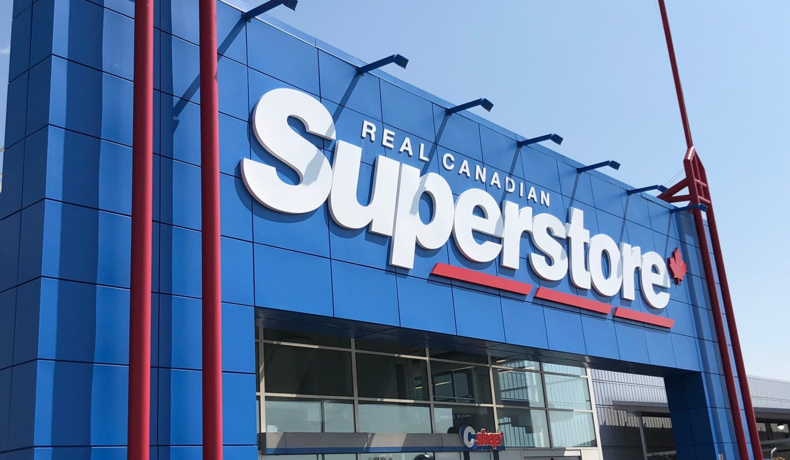

# Overview
There are 3 parts of jupyter notebook file in this project: 
1. [Part 1 - EDA.ipynb](https://github.com/titods/Identifying-Customer-Segments-and-Purchasing-Patterns-in-Retail-Industry-Superstore-/blob/main/Part%201%20-%20EDA.ipynb) consist of `Introduction`, `Load the dataset`, `Data cleaning`, and `Exploratory Data Analysis (EDA)` sections.
2. [Part 2 - Customer Segmentation.ipynb](https://github.com/titods/Identifying-Customer-Segments-and-Purchasing-Patterns-in-Retail-Industry-Superstore-/blob/main/Part%202%20-%20Customer%20Segmentation.ipynb) consist of `Customer Segmentation` section.
3. [Part 3 - Market Basket Analysis.ipynb](https://github.com/titods/Identifying-Customer-Segments-and-Purchasing-Patterns-in-Retail-Industry-Superstore-/blob/main/Part%203%20-%20Market%20Basket%20Analysis.ipynb) consist of `Market Basket Analysis`, `Conclusions`, and `Recommendations` sections.

# Introduction

Superstore is a fictional retail business located in the United States which sells Office Supplies, Furniture, and Technology Products. Their customers are the mass Consumer, Corporate and Home Offices. This business has been running from 03 January 2018. They want to analyze and assess their business performance from early 2018 to the end of 2021 such as identifying the customer segments and the purchasing patterns of customers.

*Note: the picture is for reference only*

## Objective

- To get some insights about Superstore's market performance and main driver of loss in Superstore.
- To identify and understand customer segments in Superstore.
- To identify and understand purchasing patterns of customers in Superstore.

## Business  value

- We could identify opportunities for Superstore to boost business growth.
- We could treat each customer differently according to their segments. (reducing the risk and increasing the efficiency in deciding marketing strategy deployment in Superstore).
- We could help product development team to develop a product and to create product differentiation based on history of product purchases.

## Methodology

- Exploratory Data Analysis.
- Customer segmentation using clustering algorithm i.e. K-Means, Gaussian Mixture Model, and Hierarchical Clustering.
- Market basket analysis using apriori algorithm.

## The dataset

The dataset is obtained from [Kaggle](https://www.kaggle.com/datasets/sirajahmad/superstore) and also provided in [Tableau community](https://community.tableau.com/s/question/0D54T00000CWeX8SAL/sample-superstore-sales-excelxls). The timestamps are from **03 January 2018** to **30 December 2021**. This dataset only contains sales information in United States but if you want more granular sales across different country, There are also Global Superstore dataset (click [here](https://www.kaggle.com/datasets/gauravtopre/global-superstore-dataset)) which provides more granular Superstore's sales across different country (but the timestamps are different).

There will be one file after downloading the dataset, that is `Sample - Superstore.xls` which contains sheet about the orders (`Orders` sheet name), the regional manager each region (`People` sheet name), and the returned product (`Returns` sheet name).

Data description for `Orders`:
- `Row ID` &rarr; Unique ID for each row.
- `Order ID` &rarr; Unique Order ID for each Customer.
- `Order Date` &rarr; Order Date of the product.
- `Ship Date` &rarr; Shipping Date of the Product.
- `Ship Mode` &rarr; Shipping Mode specified by the Customer.
- `Customer ID` &rarr; Unique ID to identify each Customer.
- `Customer Name` &rarr; Name of the Customer.
- `Segment` &rarr; The segment where the Customer belongs.
- `Country/Region` &rarr; Country of residence of the Customer.
- `City` &rarr; City of residence of the Customer.
- `State` &rarr; State of residence of the Customer.
- `Postal Code` &rarr; Postal Code of every Customer.
- `Region` &rarr; Region where the Customer belongs.
- `Product ID` &rarr; Unique ID of the Product.
- `Category` &rarr; Category of the Product.
- `Sub-Category` &rarr; Sub-Category of the Product.
- `Product Name` &rarr; Name of the Product.
- `Sales` &rarr; Total Sales of the Product.
- `Quantity` &rarr; Quantity of the Product.
- `Discount` &rarr; Discount provided.
- `Profit` &rarr; Profit/Loss incurred (profit = positive value & loss = negative value).

Data description for `Returns`:
- `Returned` &rarr; If the Order has been returned.
- `Order ID` &rarr; Unique Order ID for each Customer.

Data description for `People`:
- `Regional Manager` &rarr; Name of the Regional Manager.
- `Region` &rarr; Region where the Customer belongs.

# Conclusions

Here are some conclusion to sum up what we have been through so far.
1. The main driver of loss in Superstore is due to high discount given. We clearly see that the more discounts have been offered, the lesser profits have achieved. Products with no discounts show high range of profits but as the discount range increases, we only see more and more loss with hardly any profit. In fact, when the discount given is exceeding 20%, there are no more profits made by Superstore. The most profitable region so far is the Western of United States. 
2. We have used three machine learning algorithms to perform customer segmentation using LRFM model metrics. The algorithm we will implement is K-Means clustering since it gives us the highest evaluation metric scores (DB index and Silhouette score) compared to the other two algorithms. From K-Means clustering we get 4 segments (793 total customers), i.e.
    - `"Lost"` customer segment, 13.11% from total customers. They are relatively old customers (L = 2) but their last purchases are very long ago (R = 1),  purchased very few (F = 1), and spent the lowest (M = 1) compare to other segments. (`LRFM = 2111`)
    - `"Important"` customer segment, 51.32% from total customers. They are the oldest customers (L = 4), purchased most recently (R = 4) but not the most frequently (F = 3) and spent quite a lot (M = 3). (`LRFM = 4433`)
    - `"Champion"` customer segment, 19.55% from total customers. They are commonly old customers (L = 3) who have purchased quite recently (R = 3), purchased most frequently (F = 4) and spent the most (M = 4). (`LRFM = 3344`)
    - `"Potential"` customer segment, 16.0% from total customers. They have good amount of spending (M = 2) and purchases (F = 2) although they are fresh customers (L = 1) but their last purchase are quite a long ago (R = 2). (`LRFM = 1222`)
3. We have used Apriori algorithm to get some insights about purchasing patterns of customers. Those purchasing patterns are in the form of strong association rules i.e. 
    - {Binders} &rarr; {Appliances} and {Paper} &rarr; {Appliances}.
    - {Art} &rarr; {Phones} and {Furnishings} &rarr; {Phones}.
    - {Binders, Furnishings} &rarr; {Storage}.
    
   The results of this market basket analysis can be then used for a data-driven marketing strategy and decision making for product recommendation.

# Recommendations

1. Superstore has to review and evaluate the marketing strategy of offering high discount to a product since that will lead to a loss.
2. "Consumer" customer is the most profitable then followed by "Corporate" customer. The marketing strategy should always focus on retaining this two customers. For "Home Office" customer, these customers might be busy with their work and less likely to spend their time selecting individual products. Hence create a special "Home Office package" with products used for offices for them.
3. Top 5 most profitable sub-category are "Copiers", "Phones", "Accessories", "Paper", and "Binders". The marketing strategy has to focus on marketing these products, especially for high demand products, "Paper" and "Binders". 
   -  "Paper" and "Binders" are good for cross-selling strategy or bundling products to increase the profit, sales, and demand on low performance sub-category. In fact, we discover from market basket analysis that "Binders" or "Paper" are most likely purchased together with "Appliances". Hence, every time someone purchases "Binders" or "Paper" (which is most frequent to happen), we can offer "Appliances" and give reasonable discount to attract more sales.
   - "Phones" is a sub-category with the highest sales. We also see that "Art" or "Furnishings" are frequently purchased together with "Phones". Therefore, we could increase the sales on "Phones" by putting "Phones" products at a place that closer to "Art" or "Furnishings" products. This will increase the probability of purchasing "Phones" when the customers purchase "Art" or "Furnishings".
   - Create a single bundle of product with a lower price compare to each price combined for sub categories of "Binders", "Furnishings", and "Storage". This way will attract more sales and generate more income since customers who purchase "Binders" and "Furnishings" together are more likely to purchase it together with "Storage".
4. Sub category such as "Tables", "Bookcases", and "Machines" are the loss-making sub-category. Those sub-categories relatively have high average discount and low total quantity (in term of transaction too). This might indicate that the marketing strategy of giving high average discount to a low demand product to increase the sales and transactions didn't help that much. Superstore should consider another marketing strategy such as, 
    - Bundle or package them together with high selling products to create "Office Furniture Package" ("Chairs", "Tables", and "Bookcases") to offset the losses,
    - Change suppliers or bargain for cheaper price, or
    - Remove these sub-categories since they might not fit for the customer (also for "Fasteners" and "Supplies").
5. Superstore has to ensure their stock for "Office Supplies" category is always well-stocked and available over time since it is the category with the highest total transactions and quantities, especially for "Binders" and "Papers" sub-category (those are likely to be the most purchased categories every month). There is also a seasonality pattern at the end of the month where the highest total transactions and quantities has been occurring there for 4 years, they need to increase their stock for the most purchased products, so there would not be understocked product at the end of the month since over the year the trend of sales is increasing.
6. Some states have fewer in term of sales and transactions, lack of awareness can be the reason for this, hence advertising in those states might help in more sales.
7. Recommendation for segmented customers:
    - `"Champion"` customer segment: This is the most valuable customer. Focus to improve their frequency and retention such as loyalty programs, give rewards to make them feel respected, market our most expensive products on these customers, offer new products, and cross-selling/up-selling strategy.
    - `"Important"` customer segment: This is loyal customer. Focus to maintain their loyalty and improve their value such as offer a recommendation of some new products and try to give a price incentives on expensive products or more competitive price.
    - `"Potential"` customer segment: This has a potential to be a valuable customer. Focus to improve their value, retention, and frequency such as cross-selling/up-selling strategy, give price incentives and new products recomendation.
    - `"Lost"` customer segment: This customer have already churned. Focus to reactivate the customer by forming a reactivation strategy such as send them reactivation emails, make limited time offers, and ask them for feedback.
